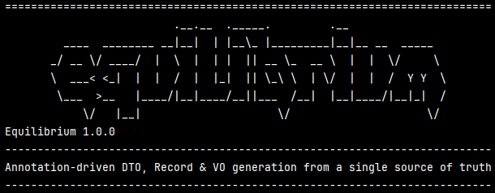

# Project Equilibrium

#### **Compile-time** generation of DTOs, Java records, and value objects — fast, type-safe, **no reflection**.



[](https://central.sonatype.com/artifact/io.github.soulcodingmatt/equilibrium)
[](https://github.com/soulcodingmatt/equilibrium/blob/main/LICENSE)

Annotate your domain model once; Project Equilibrium’s **annotation processor** generates matching **transfer types** so names, packages, and structure stay aligned. You still map *data* however you like (constructors, MapStruct, hand-written code) — this project focuses on **generating the shapes** with compile-time validation and optional Jakarta constraints on generated members.

If you find this project useful, consider supporting me ☕  
[](https://www.buymeacoffee.com/soulcodingmatt)

---

## Why Project Equilibrium?

Hand-maintained DTOs and cousins often mean:

- 😩  Boilerplate and copy-paste types that drift from the domain
- 💥  Surprises at runtime** when something no longer lines up
- 🔧  Refactors that sprawl across many files

**Project Equilibrium pushes that work to compilation:** generated Java sources, consistent defaults, and errors when configuration is impossible — not when a user hits an edge case.

✔ No reflection for generation  
✔ No extra runtime library for *creating* those type definitions  
✔ Full type safety on the processor’s configuration surface  
✔ Clean model: annotate the domain, consume generated types

Deeper rationale, trade-offs, and “when not to use it”: [Why Project Equilibrium?](docs/why-equilibrium.md).

---

## Quickstart

**1. Add the dependency** (version from [Maven Central](https://central.sonatype.com/artifact/io.github.soulcodingmatt/equilibrium)):

```xml
<dependency>
  <groupId>io.github.soulcodingmatt</groupId>
  <artifactId>equilibrium</artifactId>
  <version><!-- latest --></version>
</dependency>
```

**2. Register the processor** and set defaults (packages / postfixes). Full `pom.xml` snippet: [Build tooling](docs/build-tooling.md).

**3. Mark the domain class:**

```java
import io.github.soulcodingmatt.equilibrium.annotations.dto.GenerateDto;

@GenerateDto
public class User {
    private String name;
    private int age;
    // getters / setters
}
```

**4. Compile** — use the generated `UserDto` (or your configured package/postfix).

👉 Extended copy-paste flow: [Quickstart](docs/quickstart.md).

---

## How it works

Project Equilibrium runs as a standard **Java annotation processor**: it emits **plain source files** during `javac`, so builds stay predictable and debuggable. Details: [How it works](docs/how-it-works.md).

---

## Works well with other tools

Use Project Equilibrium **alongside** mappers and frameworks — for example **MapStruct** for field-to-field mapping between types you already have. Summary and build notes: [Ecosystem](docs/ecosystem.md).

---

## Documentation

**Index of all guides:** [docs/README.md](docs/README.md)

|                         Topic                         |                                    Guide                                     |
|-------------------------------------------------------|------------------------------------------------------------------------------|
| Why / when / benefits                                 | [Why Project Equilibrium?](docs/why-equilibrium.md)                          |
| Quickstart                                            | [docs/quickstart.md](docs/quickstart.md)                                     |
| Maven, IDE, Lombok, Gradle                            | [docs/build-tooling.md](docs/build-tooling.md)                               |
| Compiler `-A` options                                 | [docs/configuration.md](docs/configuration.md)                               |
| All annotations (generate / ignore / nest / validate) | [docs/annotations-reference.md](docs/annotations-reference.md)               |
| MapStruct and complements                             | [docs/ecosystem.md](docs/ecosystem.md)                                       |
| DTO builder + Lombok                                  | [docs/dto-builder-pattern.md](docs/dto-builder-pattern.md)                   |
| Experimental Jakarta validation                       | [docs/experimental-validation.md](docs/experimental-validation.md)           |
| DTOs + interfaces (wrapper pattern)                   | [docs/dto-interface-pattern.md](docs/dto-interface-pattern.md)               |
| Custom fields and methods on generated DTOs           | [docs/custom-fields-and-methods.md](docs/custom-fields-and-methods.md)       |
| Troubleshooting and pitfalls                          | [docs/troubleshooting-and-pitfalls.md](docs/troubleshooting-and-pitfalls.md) |

---

## Commercial use (GPL)

You can use this annotation processor in **commercial or closed-source projects** when it runs only at **compile time** and is not shipped inside your artifacts. In that typical setup, **GPL-3.0 does not require you to open-source your own application code**.

## Requirements

- **Java 21** or higher (the processor targets the Java 21 language level)
- A build tool that can **resolve dependencies** from Maven Central (or your repository) and run **annotation processing** (for example Maven 3.x or Gradle 8.x)

Older tool versions may work but are not validated. **Building Project Equilibrium** uses Maven in this repository; consuming projects do not need to run this project’s `pom.xml`.

## Features

- Generation of DTOs, records, and VOs with `@GenerateDto`, `@GenerateRecord`, and `@GenerateVo` (including **multiple generations per source class** via `id`, `pkg`, and `name`)
- **Global defaults** via compiler options (`-Aequilibrium.*`), with **per-annotation overrides** where supported
- Field exclusion with `@IgnoreDto`, `@IgnoreRecord`, `@IgnoreVo`, and `@IgnoreAll`, including **selective exclusion** with `ids` when you generate several variants from one class
- **Nested DTO wiring** with `@NestedMapping` (class reference) and **`@NestedDtoMapping`** (string class names, including **per–DTO-id** mappings when you use multiple `@GenerateDto` ids)
- Optional **Lombok `@SuperBuilder`** on generated DTOs (`@GenerateDto(builder=true)`), plus **`@DtoBuilderDefault`** for builder default values where applicable
- Field type preservation (including generics) and **inheritance**: generated types include fields from superclasses
- Optional **experimental** compile-time validation helpers (`@ValidateDto`, `@ValidateRecord`, `@ValidateVo`) that emit Jakarta Bean Validation constraints on generated members
- **Compile-time summary output**: optional banner and statistics — see [Configuration](docs/configuration.md) (compile output)

## Consuming vs building this project

**In your application:** add the published Maven dependency (`artifactId` **equilibrium**), put the processor on **`annotationProcessorPaths`**, and pass **`-Aequilibrium.*`** flags (or rely on annotation parameters) for packages and postfixes. Any tool that resolves Maven artifacts and runs Java annotation processing can consume the JAR.

**From this repository:** build with **Maven** (`mvn verify` or `mvn install`) to compile, run tests, and produce the same artifact layout this project publishes — including metadata stamped from the POM. Porting that to another build system means replicating dependency scopes, processor path, and resource packaging.

## 🤖 Usage of AI

AI tools were used throughout the development of this project — including prototyping, testing, bug fixing, and refactoring.
The primary author has over 25 years of experience with Java and more than 10 years as a professional software developer. AI was used as a productivity tool, not as a substitute for expertise.
All architectural decisions, design, and final validation were carried out by a human. AI assisted the process, but responsibility and ownership remain human.

Using tools that improve efficiency is a natural part of modern software development.

## Contributing

Contributions are welcome — issues, ideas, and pull requests.

## Changelog

See [**CHANGELOG**](CHANGELOG.md).

## License

This project is licensed under the GNU General Public License v3.0 — see the [LICENSE](LICENSE) file.

## Contact

For questions or issues, please use the repository’s issue tracker.

## Third-party software

Dependency names, how they are used (for example provided, test, or tooling scopes), and license families are documented in **[NOTICE](NOTICE)**. The published JAR includes the same text as **`META-INF/NOTICE`**. For exact artifact versions, see **`pom.xml`**.

---

