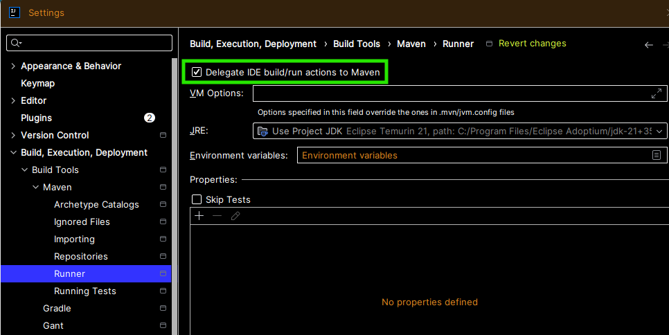
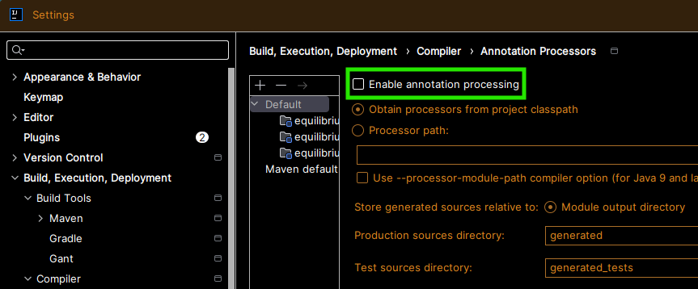

# Build tooling

Maven is the documented and validated path. Gradle is supported in principle for **Java** sources; see [Installation (Gradle)](#installation-gradle) below.

## Getting started (Maven)

**1. Add the dependency to your `pom.xml`:**

```xml
<dependency>
    <groupId>io.github.soulcodingmatt</groupId>
    <artifactId>equilibrium</artifactId>
    <version><!-- insert latest version here --></version>
</dependency>
```

**2. Configure the annotation processor in your `pom.xml`:**

```xml
<build>
    <plugins>
      <plugin>
        <groupId>org.apache.maven.plugins</groupId>
        <artifactId>maven-compiler-plugin</artifactId>
        <version><!-- insert latest version here --></version>
        <configuration>
          <release><!-- insert your java version number here, e.g. 21 --></release>
          <showWarnings>true</showWarnings>
          <compilerArgs>
            <arg>-Xlint:all</arg>
            <arg>-Aequilibrium.dto.package=com.example.dto</arg>
            <arg>-Aequilibrium.dto.postfix=Dto</arg>
            <arg>-Aequilibrium.record.package=com.example.record</arg>
            <arg>-Aequilibrium.record.postfix=Record</arg>
            <arg>-Aequilibrium.vo.package=com.example.vo</arg>
            <arg>-Aequilibrium.vo.postfix=Vo</arg>
          </compilerArgs>
          <annotationProcessorPaths>
            <path>
                <groupId>io.github.soulcodingmatt</groupId>
                <artifactId>equilibrium</artifactId>
                <version><!-- insert latest version here --></version>
            </path>
          </annotationProcessorPaths>
        </configuration>
      </plugin>
    </plugins>
</build>
```

Options reference: [Configuration](configuration.md).

## IDE and optional tooling

### IntelliJ IDEA (Maven users)

**Takeaway:** Match **`mvn compile`** by having **Maven** perform builds when you run or test from the IDE (**Delegate IDE build/run actions to Maven**, below). If instead IntelliJ’s **own** compiler runs (delegation off or partial), turn **Enable annotation processing** on so processors run there too. **Both** settings can be enabled: they are not mutually exclusive — delegation controls whether Maven runs your main build; **Annotation Processors** applies when the **IDE** compiles on its own (background build, some refactor paths). After changing `pom.xml`, **reload the Maven project** so processor paths and generated source roots stay in sync.

#### Delegate IDE build/run actions to Maven

If generated types are missing in the editor when you run or test code that references them, enable **Delegate IDE build/run actions to Maven**:

`File` → `Settings` → `Build, Execution, Deployment` → `Build Tools` → `Maven` → `Runner` → check **Delegate IDE build/run actions to Maven**.



That ties the IDE to the same compile and annotation processing as the command line. The trade-off is that running a simple `main()` may trigger a fuller Maven run. Menu paths can differ slightly in other IDE versions.

#### Enable annotation processing (Compiler)

`File` → `Settings` → `Build, Execution, Deployment` → `Compiler` → `Annotation Processors` → **Enable annotation processing**.



Turn **Enable annotation processing** on when IntelliJ compiles without Maven (see bullets below). Your project may show the checkbox off or on depending on profile; both states are fine if Maven delegation handles your builds.

- **When delegation to Maven is on:** this checkbox is often **optional** for successful **Run/Debug** builds, because Maven already runs annotation processing from your `pom.xml`.
- **When the IDE compiles without Maven:** this is **required** so Project Equilibrium (and other processors) run during IntelliJ’s compile.
- **When both are on:** normal and safe — Maven-backed actions use Maven; IntelliJ’s own compile passes can still run processors when this is enabled.

### Lombok (builders)

For `@GenerateDto(builder=true)`, add **Lombok** as a dependency and list it on **`annotationProcessorPaths`** before or alongside Project Equilibrium (order may matter for your setup; Lombok is usually first).

```xml
<project>
<!-- ... --> 
    <dependencies>
        <!-- ... -->
        <dependency>
            <groupId>org.projectlombok</groupId>
            <artifactId>lombok</artifactId>
            <version><!-- insert latest version here --></version>
        </dependency>
    </dependencies>
    <!-- ... -->
    
    <build>
        <plugins>    
            <plugin>
                <groupId>org.apache.maven.plugins</groupId>
                <artifactId>maven-compiler-plugin</artifactId>
                <version><!-- insert latest version here --></version>
                <configuration>
                    <annotationProcessorPaths>
                        <path>
                          <groupId>org.projectlombok</groupId>
                          <artifactId>lombok</artifactId>
                          <version><!-- insert latest version here --></version>
                        </path>
                        <!-- ... -->
                    </annotationProcessorPaths>
                </configuration>
            </plugin>
        </plugins>
    </build>
</project>
```

**Style note (Lombok builders and `$` in names):** With `@GenerateDto(builder=true)`, Lombok may generate identifiers containing `$` in generated builder plumbing. That follows [Lombok’s conventions](https://projectlombok.org/), not the [Google Java Style Guide](https://google.github.io/styleguide/javaguide.html) rules for hand-written names. Project Equilibrium–generated source that this processor writes avoids `$` in its own declarations; symbols with `$` appear in **Lombok-generated** code. To avoid builder internals entirely, use `@GenerateDto` without `builder=true` and rely on constructors and setters.

## Installation (Gradle)

Using Project Equilibrium from **Gradle** is **supported in principle** for **Java** projects: add the same dependency from Maven Central, register the processor on the **annotation processor classpath**, and pass the same **`-Aequilibrium.*`** compiler arguments as in Maven (packages, postfixes, banner options, and so on).

Project Equilibrium is a **Java** annotation processor: annotated **domain types must be Java** classes. **Kotlin** sources (or Kotlin-first tooling such as `kapt`) are **not** supported or tested here. That is separate from Gradle’s optional **Kotlin DSL** for build scripts (`build.gradle.kts`): you could still author the build in Kotlin DSL while compiling **Java** sources, but we do not document or verify that setup yet.

This repository is built and tested with **Maven**, and we do **not** yet ship a verified Gradle **`build.gradle`** (Groovy DSL) snippet or step-by-step instructions. If you already wire Java annotation processors in Gradle, Project Equilibrium should follow the same pattern.

**Planned:** a dedicated Gradle section with an example **Java** + Gradle build once it has been exercised and reviewed (see [Roadmap](roadmap.md)).
